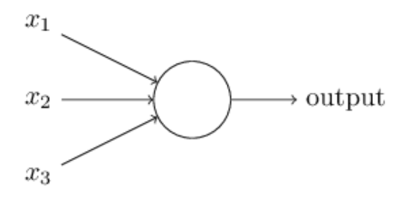
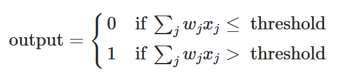
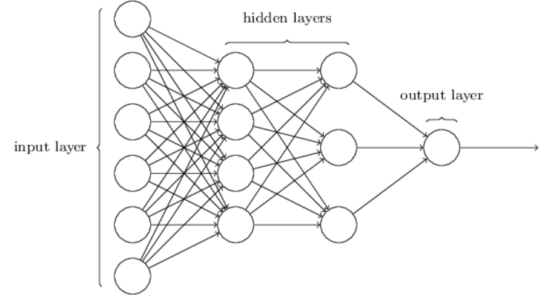

 
---
title: "Stage 1: How Neural Networks Learn"
date: 29/06/2026
---

## Reading

Nielsen, *Neural Networks and Deep Learning*, chapters 1 and 2.
[http://neuralnetworksanddeeplearning.com](http://neuralnetworksanddeeplearning.com)

Estimated time: 4-6 hours.

## Key concepts to watch for

- Forward pass: what happens to an input as it moves through the network
- Loss function: what the network is trying to minimize, and what that means geometrically
- Gradient descent: walking downhill in a very high-dimensional landscape
- Backpropagation: the chain rule, applied systematically

## Checkpoint

After finishing chapters 1 and 2, answer these in your own words:

1. What is a neural network actually doing during a forward pass?
2. What does "training" mean geometrically?
3. Does backpropagation feel mysterious after reading Nielsen, or does it reduce 
to something familiar?

*(answers below)*

## My answers

*(to be filled after reading)*

## Open questions

In a perceptron with many layers, what is the algebraic relationship between each of the layers? Are they adding non-linearities?

## Notes

```{mermaid}
%%| label: neuron-types
%%| fig-cap: "Types of neurons discussed in the chapter"

flowchart LR
    D[Contents] --> A[Types of neurons]
    D[Contents] --> E[Stochastic gradient descent, primary learning mechanism]
    A[Types of neurons] --> B[Perceptron]
    A[Types of neurons] --> C[Sigmoid neuron]
```

### Perceptron



Where $x_i$ is the input. Let $w_i$ be the weight, where the binary output results in

.

One can also write the relationship as a dot product with a bias term (equivalent to the y-intercept in a linear regression model), where the threshold information gets translated to a bias term instead.

We might use particular arrangements of weights and biases to create a system which behaves like logical gate (e.g. NAND gate). However, changing the weights and biases will alter the logic behaviour between inputs and outputs, where, the weights be automaticallt adjusted, we could, theoretically, have the perceptron "learn".

### Sigmoid neuron

The perceptron carries an intrinsic problem for learning applications, since small changes can cause large changes in the output, making it difficult to learn. This is due to the step function binary nature of the perceptron. In order to solve this problem, one can define the sigmoid neuron, which is based in a sigmoid function instead of binary.

### The architecture of neural networks

In general terms, there are three types of layers in a neural network: input layer, hidden layer(s), and output layer. The input layer receives the input data, the hidden layers perform computations and transformations on the data, and the output layer produces the final result.

.

Given these basic elements, one can construct architectures of neural networks with different arrangements of neurons. For instance, the one given immediately above is a feedforward neural network, meaning there are no loops present, and the information flows in one direction from input to output. There are, however, other arrangements which do include loops, called recurrent neural networks (RNNs).

### A simple network to classify handwritten digits

In an image with a sequence of numbers, we could break this problem into two parts: first, identify the existance of different characters and; secondly, classify each of them as a cypher. We will focus on the latter, since the first problem becomes more evident after we have solved the first.

Take each image of a digit to be 28x28 pixels, meaning a total of 784 pixels. This corresponds to the number of neurons in the input layer, for we are analysing the level of contrast of these, between black and white (between 1 and 0). Moving forward to the hidden layer, we can experiment with different number of neurons. In this example we will have 15 neurons in the hidden layer. Finally, the output layer has 10 neurons, corresponding to the digits from 0 to 9.

### Learning with gradient descent

--- I already know this, I'll get to other things ---